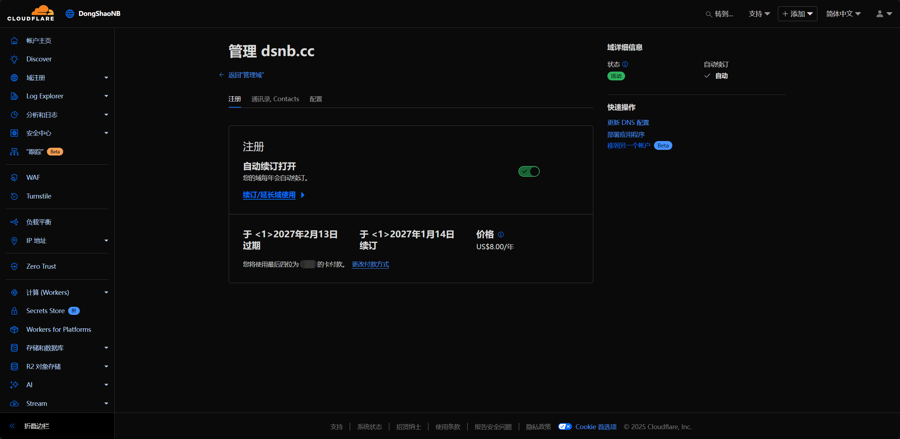

在 Cloudflare 用成本价注册域名

<!--more-->

> Cloudflare（Cloudflare, Inc.）是一家总部位于旧金山的美国跨国科技企业，以向客户提供基于反向代理的内容分发网络（Content Delivery Network, CDN）及分布式域名解析服务（Distributed Domain Name Server）为主要业务。

传统域名注册商常常通过“首年优惠 + 后续加价”赚取差价，且含各种隐形促销与附加服务。对比之下，Cloudflare 提出“只收取注册局与 ICANN 的批发费用，无任何利润加价”，意味着注册与续费价格保持一致，长期来看更省钱。

## 优点

- 成本价注册与续费
- 免费 WHOIS 隐私保护
- 一键启用 DNSSEC
- 与 Cloudflare DNS、CDN、SSL 服务无缝集成

## 缺点

在 Cloudflare 注册的域名无法更改 NameServer（名称服务器），也就是无法通过更改 NameServer 在其他服务商解析。萌新可能不理解，例如：有用户在腾讯云注册了域名，但是觉得 Cloudflare DNS 更好用，通过更改 NameServer 即可使用 Cloudflare DNS，把 DNS 解析交给 Cloudflare，但在 Cloudflare 注册域名则无法更改 NameServer，只能使用 Cloudflare DNS。当然，你仍然可以转移域名到其他服务商（个人觉得无所谓，Cloudflare DNS 就很好用）

## 准备

Cloudflare 支付方式只支持 Visa, MasterCard(万事达), 美国运通, Discover Card 和 PayPal（帖主尝试过邮储新万事达卡，因强制 3DS 无法使用。用中行长城跨境通 Visa 卡支付成功）

## 注册账号

在注册域名前，你需要先注册一个 Cloudflare 账号，按照正常注册流程注册即可，这里不过多描述

网址: https://www.cloudflare.com/

## 注册域名

登录账号进入账户主页后，点击左侧**域注册 - 注册域**

输入你想要注册的域名，比如 114514hhaaa，点击搜索，会出现**建议的域名**，这里**只展示了部分顶级域名**，如果你需要指定顶级域名，比如 **.cc**，则在搜索框后添加 .cc，搜索 114514hhaaa.cc，即可查看是否可用并注册

确定要注册的域名后，点击右侧的**购买/确认**，在注册信息页面，姓名地址电话等信息随意填写即可，无关紧要（不清楚国外的卡要不要填写正确信息，反正帖主是随便填了个美国地址）

确认信息无误后，点击**完成购买**，如果支付信息可用，即可完成购买

随后可在**域注册 - 管理域**里进行域名操作

## 转移域名

其实帖主的域名是在 NameSilo 注册，然后转移到 Cloudflare 的。**转移域名需要额外续费一年**。

首先，你需要把域名添加到 Cloudflare，点击左侧**账户主页 - Onboard a domain**，输入已在其他服务商注册的域名

选择**扫描添加 DNS 记录/手动输入 DNS 记录/上传 DNS 记录**，以及是否阻止 AI 爬虫等，点击继续

随后选择 Plan（计划），需要免费计划选择 Free 计划即可，点击**选择计划**

查看 DNS 记录，如果有扫描遗漏可以导入或手动添加，点击**继续前往激活**

根据引导修改域名的 NameServer（名称服务器）为指定的 NameServer，通常在哪注册的域名就在哪修改 NameServer

点击**继续**，当 Cloudflare 检测到 NameServer 已修改后（也可以手动点击“立即检查名称服务器”按钮），即可在 Cloudflare 上开始转移域名

点击左侧 **域注册 - 转移域**，根据引导转移域名，帖主目前没有需要转移的域名，只能口头描述一些注意事项（可能有错误，以实际情况为准）

转移前需要到**原服务商**解锁域名和关闭隐私保护，完成后 Cloudflare 需要一些时间检测，通常在 30 分钟内。随后在**原服务商**生成转移授权码，在 Cloudflare 内输入。以 NameSilo 为例，输入授权码后，你还会收到确认转移邮件，点击链接确认转移，或者在 NameSilo 后台的转移请求管理里同意。随后在 Cloudflare 里为域名续费，即转移成功

## 注意

Cloudflare 的免费计划是没有中国代理节点的，所以在添加 DNS 记录的时候，**如果勾选**代理状态，**会导致**国内访问十分缓慢，甚至无法访问

