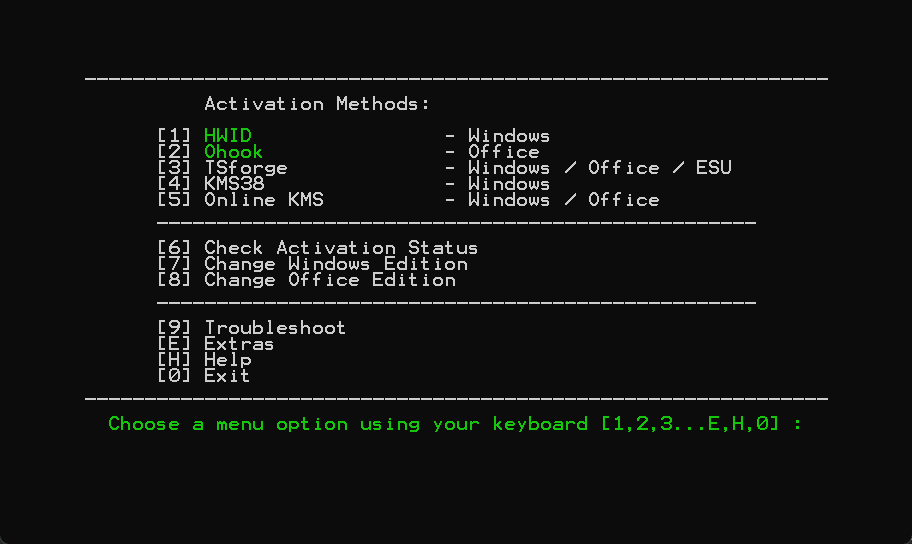

<!--more-->

**说明：本教程仅适用于 Windows 7 及更新，Windows Server 2008 R2 及更新，Office 2013 及更新**

## 激活工具下载 & 使用

如果你是 Windows 8 及以上系统，请**按下 Windows + X 并选择终端**，在终端中**输入以下命令并回车**

`irm https://get.activated.win | iex`

如果你是 Windows 7 及以上系统，请通过以下**其一**链接**下载文件并解压**，进入 **All-In-One-Version** 文件夹，运行 **MAS_AIO.cmd**

链接一: https://github.com/massgravel/Microsoft-Activation-Scripts/archive/refs/heads/master.zip

链接二: https://git.activated.win/massgrave/Microsoft-Activation-Scripts/archive/master.zip

稍等片刻，会出现图片中的 CMD 窗口

从图中可以看到，激活方法共有 5 种，**标了绿色的是推荐的激活方法**，右边对应了激活 Windows 还是 Office。**无特殊情况直接选择标绿的方法即可**，图中激活 Windows 标绿的是 HWID，我们输入前面的序号 1，回车即可。如果要激活 Office，则选择标绿的 Ohook，输入序号 2，回车即可。

**扩展功能：该工具还可以修改 Windows / Office 的版本，例如从 Windows 家庭版改到 Windows 专业工作站版。**

## HWID 激活

HWID（Hardware ID）激活，也称为数字授权（Digital License）激活，是微软自 Windows 10 起引入的一种将系统许可证与设备硬件特征绑定的机制。其核心流程为：Windows 安装或首次激活时，系统会生成一串基于主板、CPU、存储等硬件信息的唯一“硬件哈希”（HWID），并将其上传至微软激活服务器；服务器根据该 HWID 判定是否已有匹配的数字许可证，若有则返回激活成功，否则根据所用渠道（如零售密钥或在线购买）为该 HWID 创建许可证并保存。此后，在同一硬件环境下重装或更新系统时，Windows 会自动比对本地 HWID 与服务器端许可证，从而实现无需再次输入密钥的自动激活。

**作者的话：这是最好用的激活方法。它不像 KMS38 升级系统可能会掉激活，也不像 Online KMS 需要与指定的 KMS 服务器连接，而且每过 180 天就要续订。不过 HWID 激活只适用于 Windows 10 / 11，毕竟是 Windows 10 才引入的。**

## TSforge 激活

TSforge 是由 Massgrave 团队在 MAS 3.0 中引入的一种针对 Windows 软件保护平台（SPP）的深度激活绕过技术。它通过直接修改“受信任存储”（Trusted Store，又称 Physical Store）中的关键激活数据文件，实现对 Windows 7 及更高版本和 Office 2013 及更高版本的永久激活，无需联网或模拟 KMS 服务。该方法兼容范围广、持久性强，并支持激活诸如延期安全更新（ESU）等附加功能。

**作者的话：TSforge 支持范围较广，如果 HWID 不适用于你的系统，可以选择 TSforge。**

## KMS38 激活

KMS38 并非微软官方支持的激活方法，而是通过“欺骗” gatherosstate.exe 工具，将伪造的“剩余 KMS 激活期”写入受信任存储，从而让系统误以为已激活至 2038 年。
该方法通常需要将自制的 slc.dll 放置在与 gatherosstate.exe 同目录下，或通过命令行脚本注入激活票据，使 Windows 在“升级保留”阶段持久化该票据，达到无需联网的离线激活效果。

**作者的话：非必要不选择。**

## Online KMS 激活

Online KMS 利用修改系统注册表中 KMS 主机地址，为客户端指定一个公开或自建的 KMS 服务器。激活后脚本进一步创建一个名为 Activation-Renewal 的计划任务，每 7 天执行一次激活命令，以重置 180 天的激活期限，确保系统始终保持激活状态，只要计划任务和网络连接正常即可。在合法批量许可场景中，KMS 客户端默认具备微软通用批量许可密钥 (GVLK)，并在满足最小客户端或服务器数量阈值后，自动向本地 KMS 主机请求激活。

**作者的话：非必要不选择。**