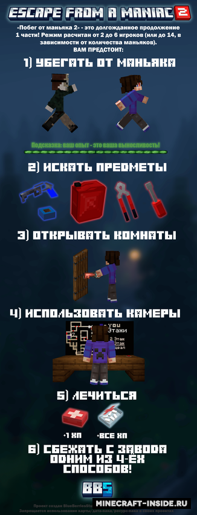
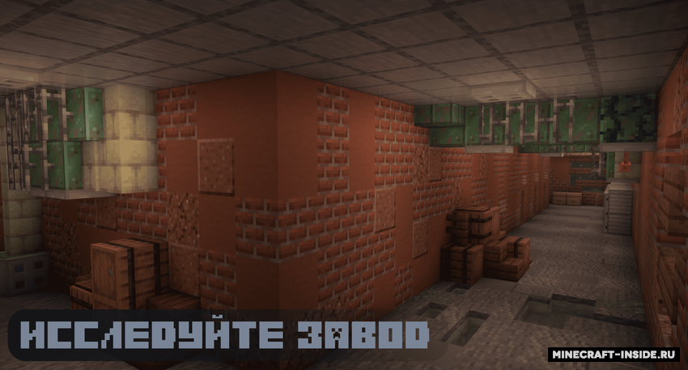
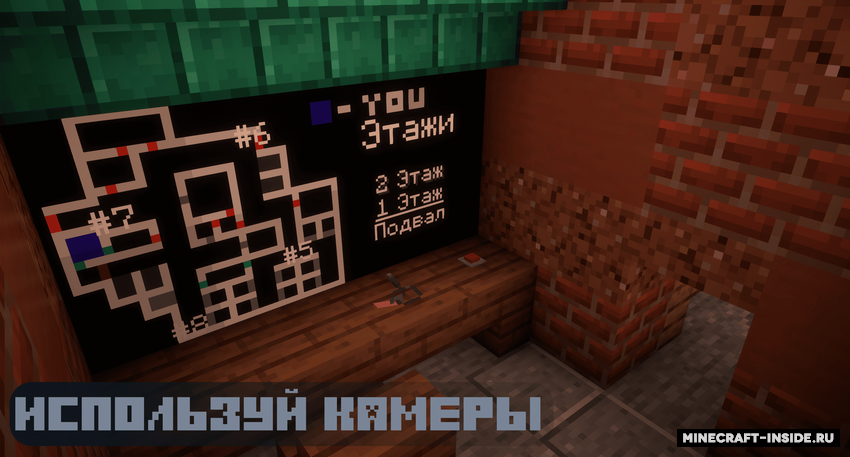
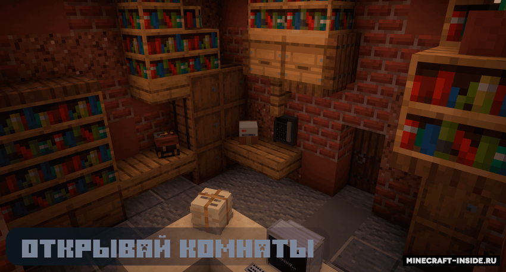
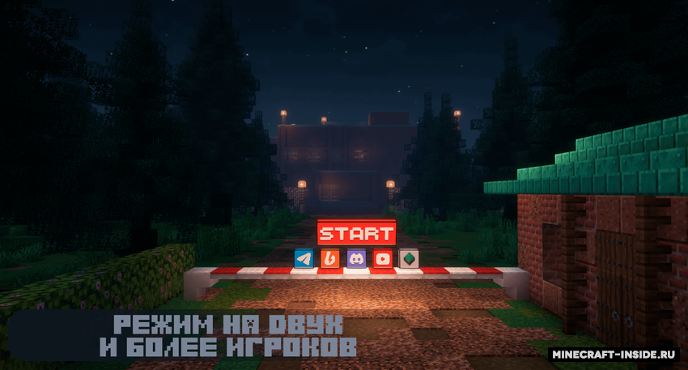
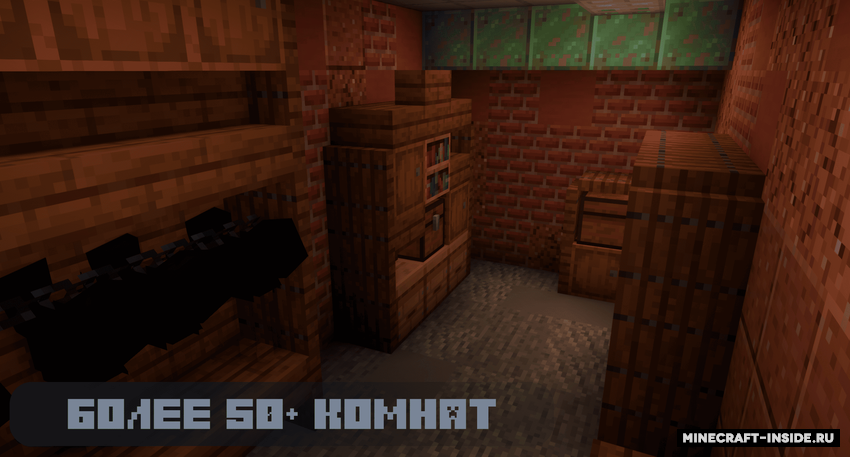
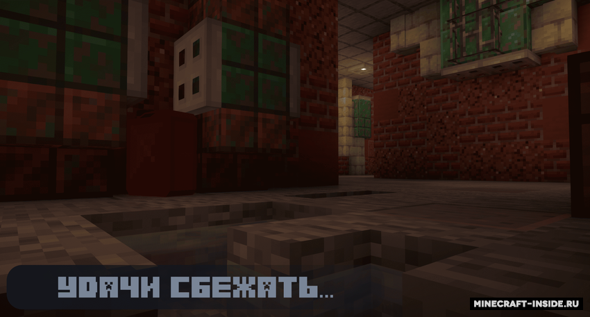

寻找物品，完成任务，在疯子的追杀下打开大门成功逃离！

<!--more-->

# 地图介绍

《逃离疯子 2》是第一部的万众期待续作！  
在这张地图中，你需要在疯子的追捕下寻找道具、完成任务、打开各处大门，最终找准时机逃出生天。

本作特色包括：

- 全新的「工厂」场景
- 4 种各不相同的逃生方式
- 物品刷新位置随机，增加可玩性
- 改进后的游戏玩法与机制
- 更多细节和趣味内容等你探索

# 截图预览

点击展开

 

# 视频推荐

马里奥红叔：

- https://www.bilibili.com/video/BV1S7CVB8EDt
- https://www.bilibili.com/video/BV1MdLpzME1p

# 地图要求

| 游戏配置 | 参数详情  |
| :------: | :-------: |
| 游戏版本 |  1.21.3   |
| 游戏人数 | 至少 2 人 |

# 下载地址

原帖：  
https://minecraft-inside.ru/maps/182258-pobeg-ot-manyaka-2.html  

汉化作者：[@北极熊IceBear](https://space.bilibili.com/46318533)  
汉化原帖：  
https://maplist.atland.icu/maps?q=%E9%80%83%E7%A6%BB%E7%96%AF%E5%AD%902  

蓝奏云：  
https://dongshao.lanzout.com/idZ643c7fo1i

# 安装汉化说明

地图汉化安装方法请参考这篇教程：  
[我的世界地图和整合包汉化安装教程](../../install-chinese-localization/)